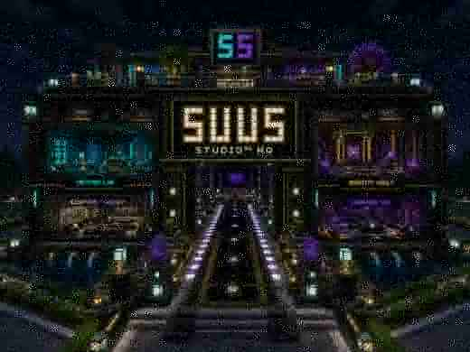
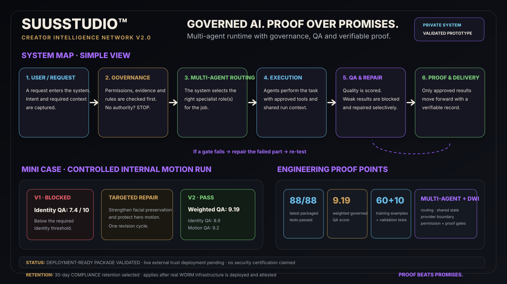

# SuusStudio™

**Creative Technologist · AI Prompt Engineer · Visual Quality Specialist · Web & Workflow Builder**

I build practical digital systems at the intersection of **AI, design, automation, web development and visual quality**. My work turns creative ideas into structured, testable products rather than isolated one-off outputs.

> **Storytelling × Marketing × Systems**

This public repository is a recruiter- and client-safe overview of **30+ systems, prototypes, frameworks, research tracks and production projects**. Proprietary source code, credentials, private client data and protected internal logic remain private.

## ⚡ 30-second recruiter scan

### Roblox Game Project
**Status:** IN DEVELOPMENT · PUBLIC LAUNCH NOT CLAIMED

An original interactive-world project built around exploration, progression, world design and repeatable game-system thinking. The project is shown publicly as active development, not as a released game.

### Minecraft · DelftV10 + SUUSSTUDIO™ Festival World
**Status:** ACTIVE BUILD · COLLABORATIVE BUILD WITH DAMIEN + RYAN

A shared Minecraft server and world-building project built with **Damien and Ryan**, combining custom environments, Java/Bedrock cross-play, event-style storytelling and iterative world QA. Public proof shows the world direction and build capability without exposing private server configuration.

### Defence Innovation · Multi-Sensor Incident Pipeline V5.0
**Status:** VERIFIED PROTOTYPE · CONTROLLED-EVALUATION READY

I built an evidence-first multi-sensor incident pipeline for aerial-object situational awareness. Camera, thermal, radar and cooperative-airspace context can be brought into one reviewable incident with transparent confidence, provenance, conflict handling, deterministic replay and mandatory human review.

**Verified V5.0 proof:** 20/20 release validation checks · 100 deterministic benchmark incidents · 25/25 identical replays · hash-chained audit trail · false-positive reconstruction · fail-closed data-rights handling.

The public case shows **what I built and what I proved** while keeping protected fusion implementation, datasets, configuration, credentials and operational sensor details private.

→ [View the Defence Innovation V5.0 public-safe case study](./DEFENCE_INNOVATION_V5.md)

### Creator Intelligence Network V2.0
**Status:** VERIFIED PROTOTYPE · PRIVATE IMPLEMENTATION

A governed multi-agent creative runtime. In simple terms: instead of asking one AI to do everything, the system can route work to specialist roles, keep one shared run state, run quality gates, repair the part that failed and require evidence before delivery.

A controlled internal motion run demonstrated **block → targeted revision → PASS**, reaching a weighted QA score of **9.19** after one revision cycle. Private orchestration logic and source code remain protected.

*Public-safe architecture view: capability and verified proof points are visible; protected implementation details remain private.*

### SEO V20 · Private commercial SEO engine
**Status:** PRIVATE SYSTEM · COMMERCIAL ACCESS ONLY

A SuusStudio™ SEO analysis system developed as a commercial product. Its implementation and customer-facing engine are intentionally not exposed through this public showcase.

Public-safe capability summary:
- website SEO analysis
- multi-category technical checks
- conservative scoring and fail-closed behaviour
- network-safety protections
- reporting-oriented output
- production deployment experience

Access is separated from Website Launch and is intended for authorized SEO customers only after payment and account activation.

### SuusStudio™ Portfolio & Framework
**Status:** PUBLIC · LIVE  
🌐 https://suus-studio.vercel.app  
🧠 https://suus-studio.vercel.app/framework

A public portfolio and systems hub covering AI-assisted creative workflows, visual QA, identity-aware generation, provenance concepts, web experiments and technical prototypes.

### Visual Operating System V20
**Status:** PRIVATE SYSTEM · ACTIVE BUILD

A structured creative operating system for scene design, identity consistency, story continuity, visual QA, physical realism and reusable generation logic. The implementation remains private while the architecture and capability are documented publicly.

### Darkweb Intelligence Layer V2.0
**Status:** PRIVATE SYSTEM · DEPLOYMENT-READY VALIDATED PROTOTYPE

A security and trust layer around AI workflows. In simple terms, it acts like a **digital doorman, fact-checker and receipt book**: it checks whether an action is allowed, whether an important claim has evidence, and whether critical steps leave a verifiable record.

If permission or proof is missing, the system is designed to **stop instead of guessing**. Protected evidence can also be locked for a defined retention window so it cannot be casually changed during that period.

The public showcase describes the capability only. Internal rules, security keys, infrastructure details, client data and protected source code remain private.

### SUUS™ Digital Nervous System
**Status:** PRIVATE SYSTEM

An internal operating-system concept connecting information, decisions, creative workflows, business processes and reusable task logic.

### Local tools & automation
Representative work includes:
- **Local Image Generator V1**
- **Free Video Engine V2.1 Recovery**
- **Laptop Keeper V1.0D** with dry-run, protected packages, review queues and fail-closed safeguards
- **Money Flow Operations System** for opportunity qualification and human-reviewed outreach workflows
- **Minecraft DelftV10 Crossplay** with Geyser/Floodgate integration and collaborative world-building with Damien and Ryan

### Selected engineering proof
Internally verified proof points include:
- **20 / 20** release validation checks in Multi-Sensor Incident Pipeline V5.0
- **100** deterministic V5.0 benchmark incidents and **25 / 25** identical replays
- **88 / 88** passing tests in the latest packaged DWI deployment-guardrail runtime
- **9.19** weighted QA score in a governed motion dry run after one targeted revision
- **60** bilingual Creator Core training examples + **10** separate validation tests
- a provider-adapter boundary that is live-ready while paid external generation remains explicit opt-in

→ [See the public-safe Engineering Proof Points](./PROOF_POINTS.md)

---

## What I build

| Area | What I do |
|---|---|
| **AI & Prompt Engineering** | Structured prompt systems, reusable logic, locked inputs, evaluation criteria and consistency controls |
| **Interactive worlds** | Roblox game-world development, Minecraft world building, cross-platform server integration and event-style interactive storytelling |
| **Multi-sensor evidence systems** | Observation normalization, evidence correlation, transparent confidence, provenance, conflicts, human review and auditability |
| **Multi-agent AI systems** | Governed routing, shared run state, specialist roles, QA gates, targeted revision and evidence-aware execution |
| **AI evaluation & training data** | Structured JSONL datasets, validation sets, evaluation scorecards and data-quality checks |
| **Web Apps** | Interactive tools, responsive interfaces, scanners, dashboards and production deployments |
| **Visual Quality** | Identity consistency, anatomy, physical realism, composition, lighting and scene-coherence QA |
| **Creative Systems** | Repeatable operating systems that connect strategy, storytelling, production and review |
| **Automation** | Local and web workflows with logging, review gates and fail-safe behaviour |
| **Identity & Provenance** | Consent-aware identity usage, traceability, usage scope and content-authenticity concepts |
| **Deployment** | Versioned GitHub workflows and production delivery through Vercel |

## Featured systems

| System | Area | Public maturity |
|---|---|---|
| **Roblox Game Project** | Interactive entertainment / world systems | IN DEVELOPMENT · PUBLIC LAUNCH NOT CLAIMED |
| **Minecraft DelftV10 + SUUSSTUDIO™ Festival World** | Cross-platform world building / event storytelling | ACTIVE BUILD · DAMIEN + RYAN COLLABORATION |
| **Multi-Sensor Incident Pipeline V5.0** | Defence innovation / sensor evidence / governance | VERIFIED PROTOTYPE · CONTROLLED-EVALUATION READY |
| **Creator Intelligence Network V2.0** | Multi-agent AI / governance / QA | VERIFIED PROTOTYPE · PRIVATE IMPLEMENTATION |
| **SEO V20** | SEO / web application | PRIVATE SYSTEM · COMMERCIAL ACCESS |
| **SuusStudio™ Framework V1.0** | Creative methodology | PUBLIC |
| **Master Image Generator V1.0** | Creative operating system | PRIVATE SYSTEM |
| **Darkweb Intelligence Layer V2.0** | AI governance / trust / evidence | PRIVATE SYSTEM · DEPLOYMENT-READY VALIDATED PROTOTYPE |
| **Creator Core V1** | AI training data / evaluation | VERIFIED DATASET / EVALUATION ASSET |
| **Identity Usage Passport V1.0** | Creator identity / rights | PUBLIC / SHOWCASE |
| **PhotoTrace Passport V1.0** | Provenance | PRIVATE SYSTEM |
| **Proof 4 · C2PA Bridge** | Content authenticity | TECHNICAL DEMO |
| **Travel Prompt Engine V1.1** | Structured generation | VERIFIED PROTOTYPE |
| **Reality-Bend Engine V1.1** | Optical-illusion research | VERIFIED PROTOTYPE |
| **Breakthrough Production Engine V1.0** | Production workflow | VERIFIED PROTOTYPE |
| **Identity Drift Governor V5** | Identity consistency | BUILT PROTOTYPE |
| **Visual Operating System V20** | Visual systems architecture | PRIVATE SYSTEM |
| **Free Video Engine V2.1 Recovery** | Local motion / video R&D | VERIFIED PROTOTYPE |
| **Laptop Keeper V1.0D** | Local maintenance / protection | PRIVATE / FAIL-CLOSED |

## Explore the work

### → [Defence Innovation V5.0](./DEFENCE_INNOVATION_V5.md)
Public-safe architecture, validation evidence, human-in-the-loop design, safety boundaries and the controlled external-evaluation route for the Multi-Sensor Incident Pipeline V5.0.

### → [Engineering Proof Points](./PROOF_POINTS.md)
A fast technical proof layer covering governed multi-agent runtime work, AI training/evaluation data, provider-adapter engineering and tested trust controls.

### → [Full Systems & Projects Catalogue](./PROJECTS.md)
Named systems, versions, purpose and maturity status across creative AI, provenance, visual QA, automation, local tooling, web systems and technical experiments.

### → [Capability Matrix](./CAPABILITIES.md)
A quick mapping from skills to representative systems and practical applications.

### → [Portfolio Verification](./VERIFICATION.md)
How public claims are classified, what was internally verified and where the evidence boundary sits.

### → [Security & Disclosure Policy](./SECURITY.md)
What is intentionally kept out of the public repository.

## Technology

`JavaScript` · `JSON` · `React` · `Vite` · `Node.js` · `Express` · `Python` · `HTML` · `CSS` · `GitHub` · `Vercel`

## How I work

**Problem → Strategy → Structured inputs → Build → Test → QA → Evidence → Deploy → Review**

The goal is not to make technology look impressive. The goal is to make it **useful, repeatable, inspectable and safer to operate**.

## Build principles

1. **Problem before promise** — build for a real need.
2. **Systems over one-offs** — reusable architecture compounds value.
3. **Proof before polish** — testing and evidence come before claims.
4. **Consistency by design** — important context and inputs are deliberately controlled.
5. **Fail safely** — uncertain automation stops or requires review instead of silently causing damage.
6. **Privacy by design** — private identity assets, credentials, client data and proprietary logic stay private.

## Public links

🌐 **SuusStudio™:** https://suus-studio.vercel.app  
🧠 **Framework:** https://suus-studio.vercel.app/framework

## Public portfolio status

**Updated:** 31 August 2026

This repository is intentionally a capability showcase rather than a source-code dump. It demonstrates what I design, build, test and deploy while protecting private implementation details and intellectual property.

Commercial engines, including SEO V20 and Website Launch builder technology, are not exposed as free public tools through this showcase.

---

© SuusStudio™. All rights reserved unless explicitly stated otherwise.
